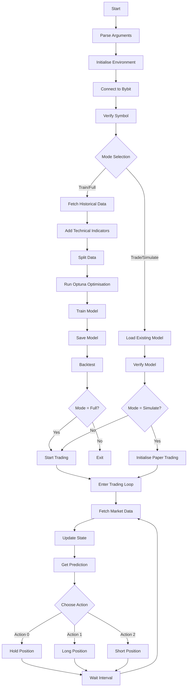
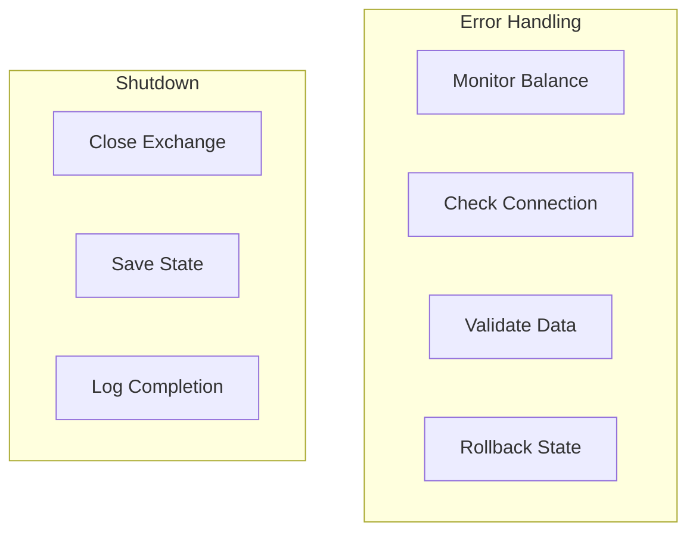

# Crypto Trading AI System

A reinforcement learning-based cryptocurrency trading system that uses the Stable-Baselines3 PPO (Proximal Policy Optimisation) algorithm to train and execute trading strategies on the Bybit exchange.

## Overview

This system implements an autonomous trading agent that:

- Trains on historical cryptocurrency data
- Optimizes its strategy using Optuna
- Can perform live trading or paper trading simulation on the Bybit exchange
- Uses technical indicators for market analysis
- Manages risk through position sizing and balance monitoring

## Core Technologies

### Stable-Baselines3 PPO

Proximal Policy Optimisation (PPO) is a state-of-the-art reinforcement learning algorithm implemented in the Stable-Baselines3 library. PPO excels at continuous control tasks like trading by maintaining a balanced approach to policy updates. Unlike traditional algorithms that might make drastic strategy changes, PPO ensures that new trading decisions don't deviate too far from previously successful strategies. This is achieved through a "trust region" approach that limits the size of policy updates, making it particularly suitable for the volatile cryptocurrency market where stability is crucial.

In this system, PPO learns to map market states (prices, technical indicators, etc.) to trading actions (buy, sell, hold) while maintaining a good balance between exploring new strategies and exploiting known profitable patterns. The "proximal" nature of PPO helps prevent catastrophic forgetting of successful trading strategies while still allowing for adaptation to changing market conditions.

### Optuna Hyperparameter Optimisation

Optuna is an automatic hyperparameter optimisation framework that uses state-of-the-art algorithms to find the optimal configuration for machine learning models. In this trading system, Optuna performs a structured search to find the best combination of parameters for our PPO model, including:

- Neural network architecture (number of layers, neurons per layer)
- Learning rates and training steps
- Policy and value function coefficients
- Risk and reward balancing parameters

The optimisation process runs multiple trials, each training a model with different parameters and evaluating its performance on historical data. Optuna uses advanced sampling algorithms and pruning mechanisms to efficiently explore the parameter space, focusing on promising configurations and early-stopping poor performers. This results in a trading model that's specifically tuned for cryptocurrency market dynamics.

## Features

### Operating Modes

The system supports multiple operating modes:

- **Full Mode** (`--mode full`): Complete pipeline including training and live trading
- **Train Mode** (`--mode train`): Model training and optimisation only
- **Trade Mode** (`--mode trade`): Live trading using a pre-trained model
- **Simulate Mode** (`--mode simulate`): Paper trading simulation using a pre-trained model

### Data Collection and Processing

- Fetches OHLCV (Open, High, Low, Close, Volume) data from Bybit
- Configurable timeframe (default: 5-minute candles)
- Implements comprehensive technical indicators including:
  - RSI (Relative Strength Index)
  - EMA (Exponential Moving Average)
  - MACD (Moving Average Convergence Divergence)
  - Bollinger Bands
  - Stochastic Oscillator
  - VWAP (Volume Weighted Average Price)
  - ATR (Average True Range)
  - Ichimoku Cloud
  - Parabolic SAR
  - CCI (Commodity Channel Index)
  - TRIX
  - Ultimate Oscillator
  - RVI (Relative Volatility Index)
  - OBV (On Balance Volume)
  - Chaikin Money Flow

### Training and Optimisation

- Uses PPO algorithm from Stable-Baselines3
- Implements Optuna for hyperparameter optimisation
- Optimizes for:
  - Learning rate
  - Number of steps
  - Gamma (discount factor)
  - Entropy coefficient
  - Value function coefficient
  - Maximum gradient norm
  - Neural network architecture
  - Activation functions

### Trading Environment

- Custom Gymnasium environment for cryptocurrency trading
- Supports:
  - Long and short positions
  - Position sizing based on risk percentage
  - Fee and slippage simulation
  - Balance tracking
  - State management with rollback capability

### Live Trading and Simulation

- Real-time trading on Bybit exchange
- Paper trading simulation mode for testing strategies
- Maintains a sliding window of market data
- Automatic position management
- Balance monitoring and error handling
- Detailed logging of trades and performance

## Prerequisites

```bash
pip install -r requirements.txt
```

Required packages:

- gymnasium
- stable-baselines3
- ccxt
- pandas
- numpy
- ta
- optuna
- torch
- python-dotenv
- tensorboard
- typing
- argparse
- torch-tb-profiler

## Model Files and Training Data

### Model Directory Structure

The `models/` directory contains two essential files for each trained model:

1. `{SYMBOL}_ppo.zip` (e.g., `DOGE_USDT_USDT_ppo.zip`):
   - Contains the trained PPO model saved by Stable-Baselines3
   - Stores neural network weights and configuration
   - Created/updated at the end of each training session
   - Required for trading and simulation modes
   - Filename is derived from the trading symbol with special characters replaced

2. `{SYMBOL}_ppo_norm.json` (e.g., `DOGE_USDT_USDT_ppo_norm.json`):
   - Contains normalisation parameters for input features
   - Stores means and standard deviations for each feature
   - Ensures consistent data normalisation between training and trading
   - Created during training and required for trading/simulation
   - Essential for maintaining model prediction consistency

### TensorBoard Logging

The `ppo_tensorboard/` directory contains training session logs:

- Separate directory for each training run (PPO_1/, PPO_2/, etc.)
- Contains detailed metrics and learning curves
- Can be viewed using TensorBoard:
  ```bash
  tensorboard --logdir=ppo_tensorboard
  ```
- Metrics include:
  - Reward evolution
  - Policy loss
  - Value function loss
  - Learning rate
  - Episode length
  - Training performance

## Configuration

1. Create a `.env` file in the project root:

```env
API_KEY=your_bybit_api_key
API_SECRET=your_bybit_api_secret
```

2. Command-line arguments:

```bash
python Main.py [arguments]

Arguments:
  --mode             Operation mode: full, train, trade, or simulate (default: full)
  --symbol           Trading symbol (default: DOGE/USDT:USDT)
  --timeframe        Trading timeframe (default: 5m)
  --models-dir       Directory for model storage (default: models)
  --initial-balance  Initial balance for training (default: 10.0)
  --risk-percentage  Risk percentage (default: 0.7)
```

## Usage

### Training Mode

```bash
python Main.py --mode train
```

The system will:

1. Fetch historical data
2. Split into training (80%) and test (20%) sets
3. Run Optuna optimisation (15 trials by default)
4. Train the model using best parameters
5. Save the model and normalisation parameters
6. Perform backtest on test data

### Live Trading Mode

```bash
python Main.py --mode trade
```

After loading a trained model, the system:

1. Initialises with recent market data
2. Begins live trading with real-time market data
3. Manages positions based on model predictions

### Simulation Mode

```bash
python Main.py --mode simulate
```

Operates like live trading mode but:

1. Uses paper trading (no real orders)
2. Provides detailed logging of simulated trades
3. Perfect for testing strategies without risk

### Full Mode

```bash
python Main.py --mode full
```

Executes the complete pipeline:

1. Trains/loads the model
2. Performs backtesting
3. Begins live trading

## Current Limitations

1. Single trading pair per instance
2. No dynamic position sizing based on volatility
3. No take-profit or stop-loss mechanisms
4. Limited to Bybit exchange
5. Fixed timeframe per session
6. No multi-asset portfolio management
7. No custom risk management rules
8. No sentiment analysis or fundamental data integration

## Error Handling

The system implements:

- Balance monitoring with automatic rollback
- Error detection for rapid balance decline
- Connection error handling
- Data validation checks
- State management with recovery options

## Logging

Comprehensive logging system with:

- Trade execution details
- Balance updates
- Error tracking
- Model training progress
- Optimisation results
- Simulation details in simulate mode

## Safety Features

1. Balance protection:
   - Monitors for significant balance drops
   - Implements rollback mechanism
   - Caps position sizes based on risk percentage

2. Error handling:
   - Graceful shutdown on interruption
   - Connection error recovery
   - Invalid data detection

## Future Improvements

Potential areas for enhancement:

1. Multi-asset support
2. Dynamic timeframe selection
3. Advanced position sizing
4. Integration of fundamental analysis
5. Portfolio optimisation
6. Custom risk management rules
7. Market regime detection
8. Sentiment analysis integration
9. Enhanced simulation capabilities
10. Multiple exchange support

## Warning

This is an experimental system. Use at your own risk. Cryptocurrency trading carries significant risk of loss. Always start with small amounts and thoroughly test any trading system before deploying with real funds.

## System Flow





## License

Copyright 2024 Sam McLeod

This project may not be used by for-profit companies without explicit permission from the author, as such the license is: [Attribution-NonCommercial-ShareAlike 4.0 International](https://creativecommons.org/licenses/by-nc-sa/4.0/legalcode.en)
